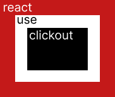

# react-use-clickout
It's custom hook that handles an event after clicking outside of the component

## Get started
Alright, let's go. First you should install the library

### Installing
Using **yarn**
```
yarn add react-use-clickout
```
Or **npm**
```
npm i react-use-clickout
```

*Prefer to install it derectly on your project, not globally*

### Using

```js
import React from 'react';
import useClickout from 'react-clickout';

function App() {
  const [
    ref, // it's to be assigned to the component reference
    bindClickout // it's a function to passa callback binding your clickout event
  ] = useClickout();
  
  /**
   * The function passed as a callback you be called 
   * if clicked out of the referenced component 
   */
  bindClickout(() => {
    console.log('clickout');
  });

  return (
    <div>
      <p ref={ref}>
        Referenced component 
      </p>
      <div>
        It's out of the referenced component
      </div>
    </div>
  );
}

export default App;
```

Changing **Events** is possible. You can pass an array with the events to be listened. The default are `mousedown` and `touchstart`.

```js
const [ref, bindClickout] = useClickout(['click']);
```


Although the name of this is *clickout* it isn't too specific about click event, you can use others.


### Pre requisites
It has the `react@^16.8.0` and `react-dom@^16.8.0` as peer-dependencies

## Contributing

